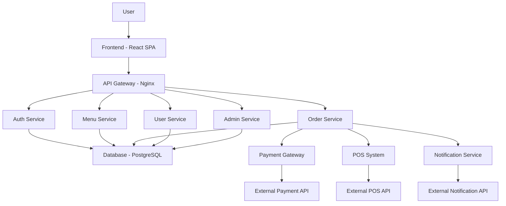

# System Architecture Diagram

## Overview
The USIU-Africa Smart Food Ordering System (SFO) is designed as a web-based application with a microservices architecture to ensure scalability, maintainability, and ease of integration. The system supports user-facing features like menu browsing, ordering, and profile management, as well as admin functionalities for oversight.

## Architecture Components
- **Frontend**: Single-page application built with React.js for responsive UI.
- **Backend**: RESTful API server using Node.js and Express.js.
- **Database**: Relational database (PostgreSQL) for structured data.
- **Authentication**: JWT-based authentication service.
- **External Integrations**: Payment gateways (e.g., M-Pesa, Stripe), POS systems, and notification services (e.g., SMS via Twilio, email).

## Diagram

## Key Flows
- User logs in via Auth Service.
- Menu browsing through Menu Service.
- Order placement via Order Service, triggering payments and notifications.
- Admin manages via Admin Service.

This architecture allows for horizontal scaling of services and secure API communications.